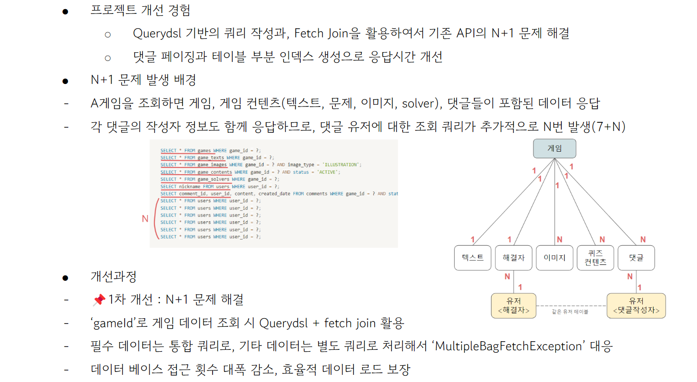

# 🧙🏻 Riddle Box

### 🎞️프로젝트 제목
- 퀴즈 게임 사이트 **Riddle Box** 
- https://www.riddle-box.com (일시중지 - 2024/04/16 배포 수정중)

 

### 🧑🏻‍💻프로젝트 설명
- **프로젝트 개요**
- 이 프로젝트는 다양한 종류의 게임을 온라인으로 제공하는 웹 플랫폼입니다. 
- 사용자는 이메일 회원가입 혹은 구글/네이버/카카오 계정으로 회원가입 및 로그인 할 수 있습니다.
- 다양한 게임을 즐기며, 게임 포인트를 카카오페이를 통해 구매할 수 있습니다.

 

### ✍🏻기술 스택
- **서버 및 백엔드 개발**: Java 17, Spring Boot 3.2.2, Spring Security 6, OAuth 2.0 (Google, Naver, Kakao)
- **프론트엔드 개발**: Thymeleaf, JavaScript, Bootstrap
- **데이터 관리 및 결제 시스템**: MariaDB, Redis, KakaoPay API

 

### 🌎배포 및 클라우드 서비스
- **AWS 인프라**: EC2, ELB, RDS, S3, CloudFront, ACM

 

### 🐻‍❄️주요 기능
- **Spring Security 적용**: 사용자 인증 및 보안 강화를 위해 Spring Security 6를 도입했습니다.
- **OAuth 2.0 통합**: Google, Naver, Kakao 등 다양한 플랫폼과의 통합을 통해 사용자의 편리한 로그인을 지원합니다.
- **Kakao Pay 결제 기능**: 안전하고 신속한 결제를 가능하게 하는 Kakao Pay API를 통한 포인트 결제 기능을 구현하였습니다.
- **다양한 게임 제공**:
   - **텍스트 기반 퀴즈**: 사용자가 읽은 내용을 바탕으로 답을 찾아가는 퀴즈 게임을 제공합니다.
   - **이미지 퀴즈 게임**: 제공된 이미지를 바탕으로 추론을 통해 관련 질문에 답하는 게임을 제공합니다.
   - **코드 해석 게임**: 제한된 시간 내에 코드를 해석하여 답을 찾는 게임을 제공합니다.
- 고객 지원: 사용자가 1:1 문의를 할 수 있는 시스템과 FAQ 페이지를 구축하여 사용자 지원을 강화했습니다.

 

### 👻기술적 성과
- **인증 로직 최적화**: 프로젝트 전반에 걸친 사용자 인증 로직을 공통 컴포넌트로 분리하여 재사용성을 높이고 유지보수를 용이하게 했습니다.
- **역할 기반 접근 제어 강화**: Spring Security를 활용하여 다양한 사용자 역할에 따라 세분화된 URL 접근 권한을 설정하였습니다.
- **보안 강화**: 최신 Spring Security 설정을 적용하여 XSS, CSRF 등의 웹 보안 취약점을 방지했습니다.
- **데이터 관리 효율성 향상**: 서버 응답 시간 및 처리량을 개선하기 위해 데이터베이스 쿼리 최적화와 캐싱 전략을 도입했습니다.
- **성능 최적화**: JMeter를 사용한 성능 테스트로 평균 응답 시간을 89% 단축하고, TPS를 30% 향상시켰습니다.
- **사용자 경험 향상**: 에러 발생 시 준비된 페이지를 제공함으로써 사용자에게 적절한 피드백을 제공하고, 이로 인해 사용자 만족도를 높였습니다.

 

### 🛠️성능개선

